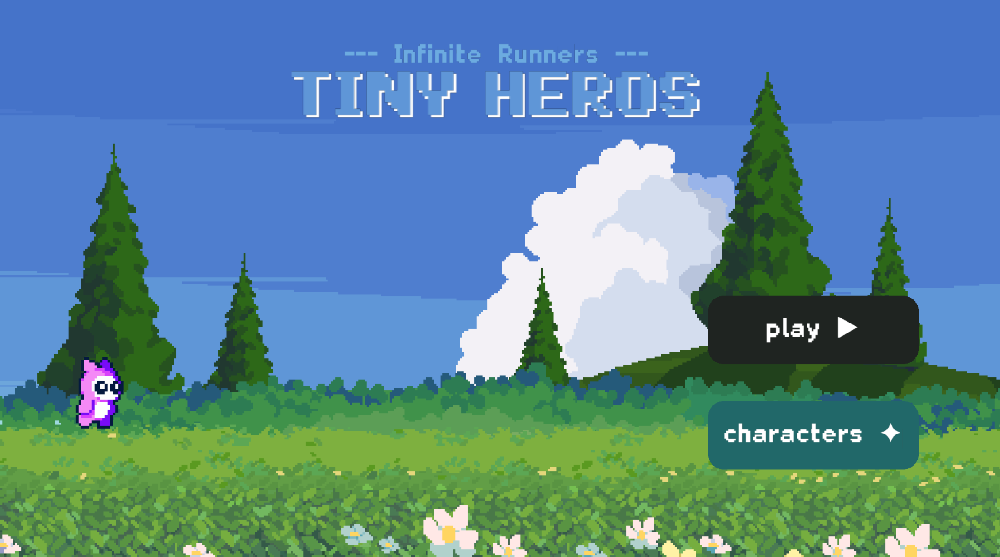
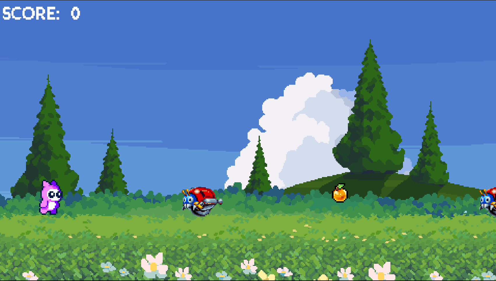
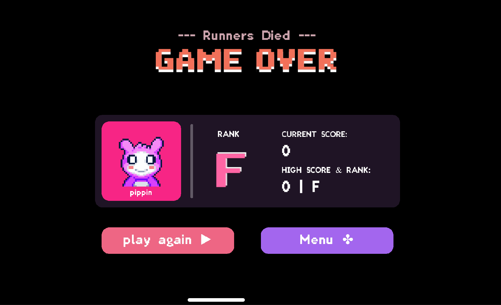
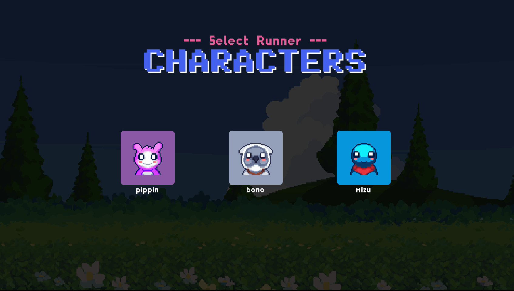

# 🎮 Tiny Heros

**An Infinite Runner Web Game with Endless Adventures!**

Tiny Heros is a captivating 2D platformer infinite runner game built with modern web technologies. Jump, dash, and survive through an endless world filled with challenges, collectibles, and fun!


*Jump into the action with Tiny Heros!*


## ✨ Features

### 🎯 Core Gameplay
- **Infinite Runner Experience** - Endless procedurally generated levels
- **Character-Driven Gameplay** - Unique hero abilities and characteristics
- **Smooth Controls** - Responsive and intuitive game mechanics
- **Addictive Replayability** - Score-based progression system

### 🎨 Visual & Audio
- **Stylish Visuals** - Beautiful 2D art style with smooth animations
- **Immersive Sounds** - Engaging sound effects and background music
- **Wholesome Aesthetic** - Family-friendly design and atmosphere

### 🌐 Technical Features
- **Lightweight & Web-Based** - Runs smoothly in any modern browser
- **Responsive Gameplay** - Optimized for different screen sizes
- **No Installation Required** - Play instantly in your browser

## 🛠️ Built With

- **JavaScript** - Core game logic and mechanics
- **[Kaplay.js](https://kaplayjs.com/)** - Modern game development library
- **HTML5 Canvas** - Rendering engine
- **Web Audio API** - Sound management

## 🎮 How to Play
1. **Jump**: Press Space or Up arrow to jump over obstacles
2. **Collect**: Gather coins and power-ups to increase your score
3. **Survive**: Avoid obstacles and enemies to keep running!


## 🚀 Getting Started

### Prerequisites
- A working browser
  

### Installation

1. **Clone the repository**
   ```bash
   git clone https://github.com/RiteshKanwar/Tiny-Heros.git
   cd Tiny-Heros
   ```

2. **Open the game**
   ```bash
   # Option 1: Open index.html directly in your browser
   open index.html
   
   # Option 2: Use a local server
   python -m http.server 8000
   # or
   npx serve .
   ```

3. **Start playing!**
   Navigate to `http://localhost:8000` in your browser

## 📁 Project Structure

```
Tiny-Heros/
├── index.html          # Main HTML file
├── style.css           # Game styling
├── script.js           # Main game logic
├── assets/             # Game assets
│   ├── sprites/        # Character and object sprites
│   ├── sounds/         # Audio files
│   └── backgrounds/    # Background images
├── screenshots/        # Game screenshots
└── README.md          # This file
```

## 🎯 Game Mechanics

### Scoring System
- **Distance**: Points earned for distance traveled
- **Collectibles**: Bonus points for coins and items
- **Multipliers**: Special power-ups increase score multiplier
- **High Score**: Track your best performance


## 📸 Screenshots

| Main Menu | Gameplay | Game Over | Characters |
|-----------|----------|-----------|-----------|
|  |  |  |  

## 🤝 Contributing

Contributions are welcome! Here's how you can help:

1. **Fork** the repository
2. **Create** a feature branch (`git checkout -b feature/amazing-feature`)
3. **Commit** your changes (`git commit -m 'Add amazing feature'`)
4. **Push** to the branch (`git push origin feature/amazing-feature`)
5. **Open** a Pull Request

### Development Guidelines
- Follow existing code style and structure
- Test your changes thoroughly
- Update documentation as needed
- Add comments for complex logic

## 🐛 Bug Reports & Feature Requests

Found a bug or have an idea for improvement? We'd love to hear from you!

- **Bug Reports**: [Open an issue](https://github.com/RiteshKanwar/Tiny-Heros/issues) with detailed steps to reproduce
- **Feature Requests**: [Start a discussion](https://github.com/RiteshKanwar/Tiny-Heros/discussions) about your idea

## 📜 License

This project is licensed under the MIT License - see the [LICENSE](LICENSE) file for details.

## 🙏 Acknowledgments

- **Kaplay.js Team** - For the amazing game development library
- **Open Source Community** - For inspiration and resources
- **Players** - For testing and feedback

## 🔗 Links

- [Live Demo](https://modestcat.itch.io/tiny-heros)
- [Kaplay.js Documentation](https://kaplayjs.com/doc/)
- [Report Issues](https://github.com/RiteshKanwar/Tiny-Heros/issues)

---

<div align="center">

**⭐ Star this repository if you enjoyed the game! ⭐**

Made with ❤️ and JavaScript

</div>
